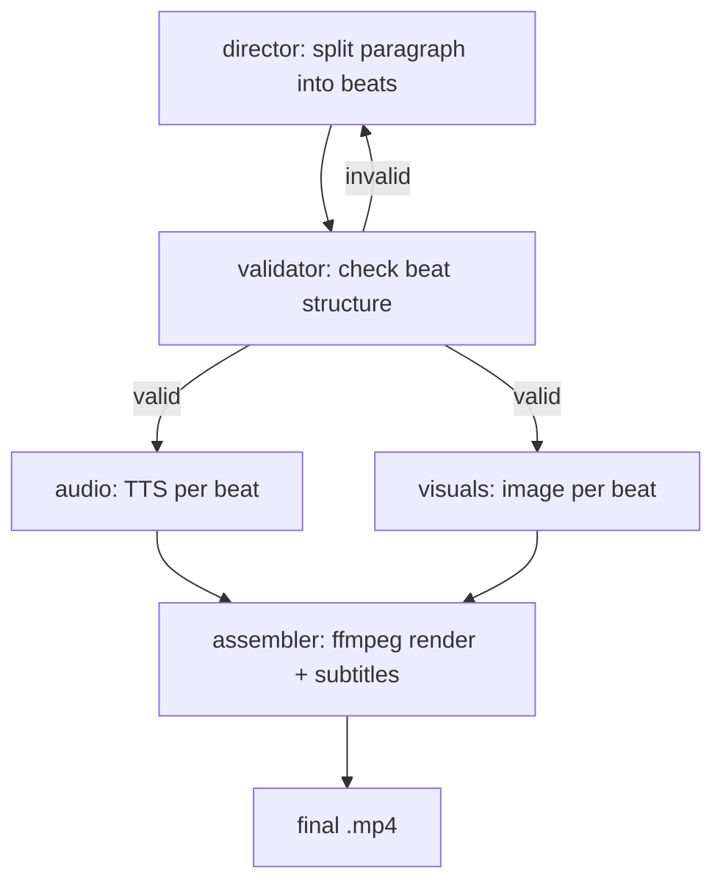

# Finance/Content Shorts making Video Pipeline

Takes a paragraph of finance or geopolitics text and turns it into a narrated
vertical short video with subtitles. Input is text, output is an `.mp4`.


Demo video: [sample/short_2026-08-27_15-01-27.mp4](sample/short_2026-08-27_15-01-27.mp4)


## How it works

The paragraph is split into 5-12 short "beats" by an LLM. Each beat gets a
narration line and an image prompt. Audio and images are then generated per
beat, and ffmpeg assembles the beats into one video with a pan/zoom effect
and burned-in subtitles.



`audio` and `visuals` run independently once validation passes, and both
feed into `assembler`.

## Nodes

| Node | Input | Output | External call | If it fails |
|---|---|---|---|---|
| `director` | raw paragraph | list of beats (text + image prompt) | Groq LLM | retries up to 5x with backoff, then raises `DirectorGenerationError` |
| `validator` | beats | same beats, cleaned, or a retry signal | none | after 3 failed attempts, raises `ValidationRepairError` |
| `audio` | beat text | `.wav` per beat + duration | Kokoro TTS (local) | raises `AudioGenerationError` on first failed beat |
| `visuals` | beat image prompt | `.png` per beat | Pollinations.ai | retries up to 5x per image, then raises `VisualGenerationError` |
| `assembler` | beats with audio + image paths | final `.mp4` | ffmpeg (subprocess) | raises `AssemblyError` |

Each beat is roughly 4 seconds of narration (12-18 words). The director is
told to always return at least 5 beats even for short input, so a single
sentence still becomes a full pipeline run.

## Why it's built this way

**LangGraph instead of a plain function chain.** The `audio` and `visuals`
steps don't depend on each other, only on the validated beats. LangGraph's
conditional edges let both run off the same validator output without a
manual thread pool.

**Validator as a separate node from the director.** The LLM's JSON output
isn't trusted directly. `validator` checks beat count and that every beat
has non-empty `text` and `image_prompt` before anything downstream runs on
it, since a malformed beat would otherwise fail deep inside audio or image
generation where it's harder to debug.

**Quota check before the run starts.** `check_quota_before_run` reads a
local token counter and refuses to start if usage is near the Groq daily
limit, instead of finding out mid-run when a request gets rejected partway
through a beat.

**ffmpeg over a Python video library.** Each beat becomes its own clip
(`zoompan` for the pan/zoom effect on a static image), clips are
concatenated, then subtitles are burned in as a final pass. Three ffmpeg
passes instead of one, but each pass is independently retriable and
inspectable — a bad clip shows up as one broken file in `checkpoints/`, not
a stack trace from inside a Python video-editing library.

**Two log handlers, no `StreamHandler`.** A `DEBUG`-level file gets every
event; an `ERROR`-level file gets only failures, so a bad run can be
diagnosed by reading a few lines instead of the full log. Console output
goes through explicit `print()` calls, not the logging module, to avoid
every beat-level log line also printing raw.

## Known limitations

- **Validator retries don't add feedback.** If validation fails, the
  pipeline loops back to `director` with the same input and no information
  about what was wrong. If the LLM is consistently generating too few
  beats for a given paragraph, all 3 attempts fail the same way.
- **Beat count can change between retries.** State merging pairs up beats
  from the previous attempt and the new one by position (`zip`). If a retry
  returns a different number of beats, the extra ones on either side are
  dropped silently instead of raising an error.
- **Quota check and quota recording aren't atomic together.** The check
  happens once before the run, the token count is only written after the
  Groq call returns. Two runs started close together could both pass the
  check before either has recorded usage. Not an issue for one run at a
  time; would be an issue if this ran concurrently.
- No automated tests. Each node has been run and produces working output,
  but there's no regression check if a dependency (Kokoro, Pollinations,
  ffmpeg flags) changes behavior.

## Project structure

```
config.py              # paths, model names, thresholds — reads from .env
state.py                # PipelineState, Beat, and beat-merging logic
main.py                  # builds and runs the LangGraph graph
nodes/
  node_director.py        # LLM: paragraph → beats
  node_validator.py       # checks beat structure, triggers retry
  node_audio.py            # Kokoro TTS: beat text → .wav
  node_visuals.py           # Pollinations.ai: image prompt → .png
  node_assembler.py          # ffmpeg: clips → concatenated video → subtitles
utils/
  logger_setup.py         # file + console logging
  quota_tracker.py         # Groq daily token tracking
data/
  checkpoints/<run_id>/     # per-run intermediate audio/images/clips
  output/                    # final rendered videos
logs/
  run_<id>.log               # full run log
  errors_<id>.log             # errors only
```

## Setup

Requires `ffmpeg` installed and on `PATH`, plus a `.env` with:

```
GROQ_API_KEY=...
```

```bash
pip install -r requirements.txt
python main.py "your paragraph here"
# or
python main.py path/to/paragraph.txt
```

Output lands in `data/output/short_<run_id>.mp4`.